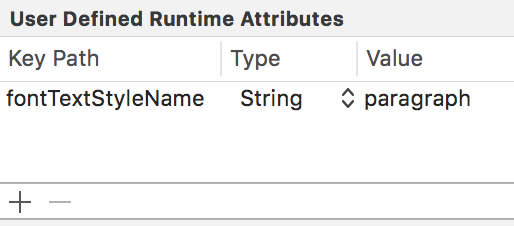

[](https://travis-ci.org/rwbutler/TypographyKit)
[](http://cocoapods.org/pods/TypographyKit)
[](https://github.com/Carthage/Carthage)
[](http://cocoapods.org/pods/TypographyKit)
[](http://cocoapods.org/pods/TypographyKit)

TypographyKit makes it easy to define typography styles and colour palettes in your iOS app helping you achieve visual consistency in your design as well as supporting [Dynamic Type](https://developer.apple.com/ios/human-interface-guidelines/visual-design/typography/) even when using custom fonts. [[More information]](https://medium.com/@rwbutler/typographykit-an-ios-framework-to-help-you-support-dynamic-type-and-enable-visual-consistency-bce7e4a82c30)

## Features

- [x] Dynamic Type support for UILabel, UIButton, UITextField and UITextView as well as some support for NSAttributedString.
- [x] Dynamic Type support for custom fonts prior to iOS 11 (iOS 9 onwards).
- [x] Optionally support Dynamic Type using *zero code* (by setting the `fontTextStyleName` key path String to the name of your typography style in IB). 
- [x] Helps make your app visually consistent across all screen by allowing you to define all of your typography styles and app color scheme in a single location.
- [x] Host and update your font styles and color schemes [remotely](#remote-configuration). [[Blog post]](https://medium.com/@rwbutler/remotely-configured-colour-palettes-in-typographykit-e565c927e2b4)
- [x] Use [Palette](https://github.com/rwbutler/TypographyKitPalette) to make the same colour scheme used programmatically available for use in Interface Builder. [[Blog post]](https://medium.com/@rwbutler/palette-for-typographykit-fd724f324c52)
- [x] Define letter case as part of typography styles with [simple letter case conversion available](#letter-casing).
- [x] Use either a PList or JSON to define your TypographyKit configuration. 

## Installation

### Cocoapods

[CocoaPods](http://cocoapods.org) is a dependency manager which integrates dependencies into your Xcode workspace. To install it using [RubyGems](https://rubygems.org/) run:

```
gem install cocoapods
```

To install TypographyKit using Cocoapods, simply add the following line to your Podfile:

```
pod "TypographyKit"
```

Then run the command:

```
pod install
```

For more information [see here](https://cocoapods.org/#getstarted).

### Carthage

Carthage is a dependency manager which produces a binary for manual integration into your project. It can be installed via [Homebrew](https://brew.sh/) using the commands:

```
brew update
brew install carthage
```

In order to integrate TypographyKit into your project via Carthage, add the following line to your project's Cartfile:

```
github "rwbutler/TypographyKit"
```

From the macOS Terminal run `carthage update --platform iOS` to build the framework then drag `TypographyKit.framework` into your Xcode project.

For more information [see here](https://github.com/Carthage/Carthage#quick-start).

## Example App

An example app exists in the [Example directory](https://github.com/rwbutler/TypographyKit/tree/master/Example) to provide some pointers on getting started.

## Usage

Include a TypographyKit.plist as part of your app project ([example](./Example/TypographyKit/TypographyKit.plist)) in which you define your typography styles.

	<key>ui-font-text-styles</key>
	<dict>
		<key>heading</key>
		<dict>
			<key>font-name</key>
			<string>Avenir-Medium</string>
			<key>point-size</key>
			<integer>36</integer>
		</dict>
	</dict>

Or if you prefer to use JSON you may include a TypographyKit.json ([example](./Example/TypographyKit/TypographyKit.json)) instead.

Define additional UIFontTextStyles within your app matching those defined in your .plist:

```
extension UIFontTextStyle
{
    static let heading = UIFontTextStyle(rawValue: "heading")
}
```

Where you would usually set the text on a UILabel e.g.
```
self.titleLabel.text = "My label text"
```

Use TypographyKit's UIKit additions:
```
self.titleLabel.text("My label text", style: .heading)
```

Or where your text has been set through IB simply set the UIFontTextStyle programmatically:
```
self.titleLabel.fontTextStyle = .heading
```

If you are happy to use strings, an alternative means of setting the `fontTextStyle` property is to set the key path `fontTextStyleName` on your UIKit element to the string value representing your fontTextStyle - in the example above, this would be 'heading'.



Using this method it is possible to support Dynamic Type in your application with *zero code*.

Your UILabel and UIButton elements will automatically respond to changes in the Dynamic Type setting on iOS on setting a UIFontTextStyle with no further work needed.

### Typography Styles
Typography styles you define in TypographyKit.plist can optionally include a text color and a letter case.

	<key>ui-font-text-styles</key>
	<dict>
		<key>heading</key>
		<dict>
			<key>font-name</key>
			<string>Avenir-Medium</string>
			<key>point-size</key>
			<integer>36</integer>
			<key>text-color</key>
			<string>#2C0E8C</string>
			<key>letter-case</key>
			<string>upper</string>
		</dict>
	</dict>

### Color Palettes
Android has from the start provided developers with the means to define a color palette for an app in the form of the colors.xml file. Colors.xml also allows developers to define colors by their hex values. TypographyKit allows developers to define a color palette for an app by creating an entry in the TypographyKit.plist.

    <key>typography-colors</key>
    <dict>
        <key>blueGem</key>
        <string>#2C0E8C</string>
    </dict>

Colors can be defined using hex values, RGB values or simple colors by using their names e.g. 'blue'.

	<key>typography-colors</key>
    <dict>
        <key>blueGem</key>
        <string>rgb(44, 14, 140)</string>
    </dict>
    
Create a UIColor extension to use the newly-defined colors throughout your app:

```
extension UIColor {
    static let blueGem: UIColor = TypographyKit.colors["blueGem"]!
}
```    
    
Or:
   
```
extension UIColor {
	static let fallback: UIColor = .black
	static let blueGem: UIColor = TypographyKit.colors["blueGem"] ?? fallback
}
```    
 
Your named colors can be used when defining your typography styles in TypographyKit.plist.
 
 	<key>ui-font-text-styles</key>
	<dict>
		<key>heading</key>
		<dict>
			<key>font-name</key>
			<string>Avenir-Medium</string>
			<key>point-size</key>
			<integer>36</integer>
			<key>text-color</key>
			<string>blueGem</string>
		</dict>
	</dict>
	
	
It is also possible override the text color of a typography style on a case-by-case basis:

```
myLabel.text("hello world", style: .heading, textColor: .blue)
```

### iOS 11
TypographyKit also supports definition of colors via asset catalogs  available from iOS 11 onwards. Simply include the name of the color as part of your style in ```TypographyKit.plist``` and if the color is found in your asset catalog it will automatically be applied.

### Letter Casing

Useful String additions are provided to easily convert letter case. 

```
let pangram = "The quick brown fox jumps over the lazy dog"
let upperCamelCased = pangram.letterCase(.upperCamel)
print(upperCamelCased)
// prints TheQuickBrownFoxJumpsOverTheLazyDog
```
With numerous convenience functions:

```
let upperCamelCased = pangram.upperCamelCased()
// prints TheQuickBrownFoxJumpsOverTheLazyDog

let kebabCased = pangram.kebabCased()
// prints the-quick-brown-fox-jumps-over-the-lazy-dog
```

Typography styles can be assigned a default letter casing.

	<key>ui-font-text-styles</key>
	<dict>
		<key>heading</key>
		<dict>
			<key>font-name</key>
			<string>Avenir-Medium</string>
			<key>point-size</key>
			<integer>36</integer>
			<key>letter-case</key>
			<string>upper</string>
		</dict>
	</dict>

However occasionally, you may need to override the default letter casing of a typography style:

```
myLabel.text("hello world", style: .heading, letterCase: .capitalized)
```

### Dynamic Type Configuration
By default, your font point size will increase by 2 points for each notch on the Larger Text slider in the iOS accessibility settings however you may optionally specify how your UIKit elements react to changes in UIContentSizeCategory. 

You may specify your own point step size and multiplier by inclusion of a dictionary with key ```typography-kit``` as part of your ```TypographyKit.plist``` file.

	<key>typography-kit</key>
	<dict>
	  <key>minimum-point-size</key>
		<integer>10</integer>
		<key>maximum-point-size</key>
		<integer>100</integer>
		<key>point-step-size</key>
		<integer>2</integer>
		<key>point-step-multiplier</key>
		<integer>1</integer>
	</dict>

Optionally, you may clamp the font point size to a lower and / or upper bound using the `minimum-point-size` and `maximum-point-size` properties.

### Remote Configuration
TypographyKit also allows you to host your configuration remotely so that your colors and font styles can be updated dynamically. To do so, simply add the following line to your app delegate so that it is invoked when your app finishes launching:

```
TypographyKit.configurationURL = URL(string: "https://github.com/rwbutler/TypographyKit/blob/master/Example/TypographyKit/TypographyKit.plist")
```

Your typography styles and colors will be updated the next time your app is launched. However, should you need your styles to be updated sooner you may call ``` TypographyKit.refresh()```.

## Author

Ross Butler

## License

TypographyKit is available under the MIT license. See the [LICENSE file](./LICENSE) for more info.
